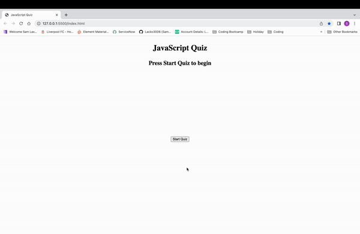

# JavaScript Marvel Quiz

## Description

This web application is my JavaScript Marvel quiz, I have used HTML, CSS & JavaScript to create a quiz that counts your score when you choose a correct answer, or lose points and time from the timer if you choose the wrong answer. When the quiz is finished you will be asked to give initials to save to the local storage along with your score.

This project was completed to further pursue different skills used in JavaScript to help me further my knowledge in web development.

## Mock Up

## Link
https://lacko3006.github.io/javascript-quiz/